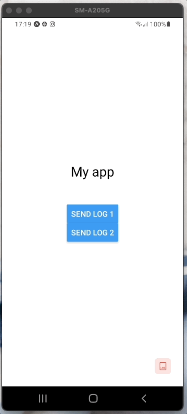

# react-native-debug-on-the-fly

Tool created to assist in debugging react native applications

<p align="center">
  <a href="https://www.gatsbyjs.org">
    
  </a>
</p>

## Installation

```sh
npm install react-native-debug-on-the-fly
```

## Usage

Add the DOTF provider on top level of your app

```js
import { DOTFProvider } from 'react-native-debug-on-the-fly';


//...
    <DOTFProvider enabled>
      <App />
    </DOTFProvider>
//...
}

```

To send logs use the `pushLog` function

```js
import * as React from 'react';
import { StyleSheet, View, Text, Button } from 'react-native';
import { useDOTF } from 'react-native-debug-on-the-fly';

const Content = () => {
  const { pushLog, clear, logs } = useDOTF();
  return (
    <View style={styles.container}>
      <Text style={styles.title}>My app</Text>
      <Button
        title="Send log 1"
        onPress={() =>
          pushLog(
            JSON.stringify(
              { foo: 'bar', bar: 'foo', obj: { foo: 'bar' } },
              null,
              2
            )
          )
        }
      />
      <Button
        title="Send log 2"
        onPress={() => pushLog(`log ${Math.floor(Math.random() * 100)}`)}
      />
    </View>
  );
};
```

## Table of props

### Provider

| Property | Type      | Description                                                                                                               |
| -------- | --------- | ------------------------------------------------------------------------------------------------------------------------- |
| enabled  | `boolean` | Indicates if the tool is enabled and will receive logs. When `false`, the logs are not stored and the tool is not visible |

### Hook

| Property | Type                                | Description                            |
| -------- | ----------------------------------- | -------------------------------------- |
| logs     | `{time: string, content: string}[]` | List of logs                           |
| pushLog  | `() => void`                        | Function that adds the log to the list |
| clear    | `() => void`                        | Clear the log list                     |

## Contributing

See the [contributing guide](CONTRIBUTING.md) to learn how to contribute to the repository and the development workflow.

## License

MIT

---

Made with [create-react-native-library](https://github.com/callstack/react-native-builder-bob)
